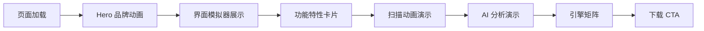

# XIGUASecurity 10.2.24 产品展示页 PRD

## 1. 产品概述
为 XIGUASecurity 10.2.24 构建一个高视觉冲击力的宣传展示页面，通过网页动画和交互效果展示杀毒软件的核心界面、功能模块与防护能力。页面面向潜在用户与安全爱好者，用于产品发布、功能演示与下载引导。

## 2. 核心功能

### 2.1 功能模块
1. **开场 Hero 区域**：全屏品牌动画，展示 XIGUASecurity Logo、版本号与产品口号
2. **界面复刻展示**：用网页动画还原真实软件的侧边栏、首页、扫描页、AI 分析页、设置页等界面
3. **功能特性展示**：通过卡片、图标、动态图表展示核心能力（驱动防护、实时防护、AI 分析、脚本扫描、云端查杀等）
4. **引擎能力展示**：展示病毒检测引擎、云端引擎、白名单引擎等版本信息
5. **下载/行动召唤**：引导用户下载或体验产品

### 2.2 页面详情
| 页面 | 模块 | 功能描述 |
|------|------|----------|
| 展示页 | Hero 区域 | 品牌入场动画、标题缩放、粒子背景、版本号淡入 |
| 展示页 | 界面模拟器 | 可交互的软件界面窗口，展示侧边栏、统计卡片、实时状态 |
| 展示页 | 特性卡片 | 6 个核心功能卡片，带悬停 3D 倾斜和光效 |
| 展示页 | 扫描动画 | 模拟文件扫描过程，进度条、威胁检测、结果统计 |
| 展示页 | 引擎矩阵 | 8 个检测引擎的展示，带状态指示灯和版本号 |
| 展示页 | AI 分析演示 | 模拟 AI 对话窗口，展示进程获取、文件定位等 MCP 工具 |
| 展示页 | CTA 区域 | 下载按钮、版本信息、系统要求 |

## 3. 核心流程

用户进入页面后，首先观看品牌入场动画。随后滚动页面，依次看到软件界面模拟器、功能特性卡片、扫描动画演示、AI 分析演示、引擎矩阵和下载 CTA。页面通过滚动触发、鼠标悬停和自动播放动画保持高参与度。

## 4. 用户界面设计

### 4.1 设计风格
- **主色调**：深色科技蓝 (#0a0f1a, #1a2332, #3b82f6, #60a5fa, #00d4aa)
- **强调色**：荧光青绿 (#00d4aa) 用于安全状态、进度、高亮
- **危险色**：#ef4444 用于威胁、警告状态
- **字体**：标题使用 Orbitron + 思源黑体，正文使用 Inter/Noto Sans SC
- **按钮风格**：圆角 12px，玻璃拟态（glassmorphism）背景，微光边框
- **布局风格**：单页长滚动，分段式大标题，卡片网格，非对称构图
- **图标风格**：线性图标，2px 描边，科技风

### 4.2 动画效果
- **Hero**：文字从 scale 1.5 缩放到 1.0，伴随透明度渐变；背景有缓慢漂浮的粒子网格
- **界面模拟器**：窗口从底部滑入，内部元素依次出现（侧边栏、卡片、状态指示器）
- **功能卡片**：滚动进入时交错淡入；悬停时 3D 倾斜、边框光效流动
- **扫描动画**：进度条填充，扫描文件列表滚动，威胁文件标红并抖动
- **AI 分析**：打字机效果输出 AI 回复，工具调用卡片翻转出现
- **引擎矩阵**：每个引擎卡片带脉冲状态灯，鼠标悬停时放大
- **CTA**：下载按钮呼吸光效，周围有光圈扩散

### 4.3 响应式设计
- 桌面优先，适配 1920px / 1440px / 1024px / 768px / 375px
- 移动端将网格改为单列，动画简化为淡入上移
- 触控设备支持滑动浏览功能卡片

### 4.4 视觉细节
- 背景使用深空渐变 + 网格线 +  subtle noise 纹理
- 卡片使用半透明深色背景、模糊、1px 边框
- 关键元素使用 box-shadow 光晕营造科技感
- 不使用占位图，所有图形用 CSS/SVG 实现
