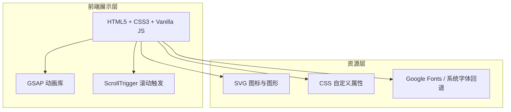

# XIGUASecurity 10.2.24 产品展示页技术架构

## 1. 架构设计



## 2. 技术描述

- **前端**: 纯静态 HTML5 + CSS3 + 原生 JavaScript（不引入复杂框架，保证单文件可独立运行）
- **动画库**: GSAP 3 + ScrollTrigger 插件，用于时间轴动画和滚动触发
- **图标**: 内联 SVG，无需外部图标库
- **字体**: Orbitron（标题）、Noto Sans SC（正文），通过 Google Fonts 引入，系统字体回退
- **构建工具**: 无需构建工具，直接浏览器打开 `index.html` 即可运行
- **后端**: 无
- **数据**: 全部内联在 HTML/JS 中，使用 mock 数据

## 3. 文件结构

```
promo-site/
├── index.html          # 主页面，包含所有模块
├── css/
│   └── style.css       # 全局样式、动画关键帧、响应式
├── js/
│   └── main.js         # GSAP 动画、界面模拟器逻辑、交互
└── assets/
    └── logo.svg        # 品牌 Logo SVG
```

## 4. 路由定义

| 路由 | 说明 |
|------|------|
| /index.html | 单页展示页，所有模块通过锚点滚动访问 |

## 5. 关键模块实现

### 5.1 Hero 动画
- 使用 GSAP timeline 控制标题、副标题、版本号的入场
- 背景粒子使用 CSS 动画或 requestAnimationFrame 实现漂浮

### 5.2 界面模拟器
- 用纯 HTML/CSS 构建一个假的软件窗口
- 使用 GSAP 控制窗口打开、侧边栏展开、卡片依次出现
- 内部数据为静态 mock，展示首页统计卡片和防护状态

### 5.3 扫描动画
- 使用 JS 定时器更新进度条和文件列表
- 随机生成威胁结果，配合红色高亮和抖动动画

### 5.4 AI 分析演示
- 打字机效果输出文本
- 工具调用卡片通过 class 切换实现展开/收起

### 5.5 响应式适配
- 使用 CSS 变量 + media queries
- 移动端禁用复杂 3D 倾斜效果

## 6. 性能考量
- 所有动画优先使用 transform 和 opacity
- 减少重排重绘
- 使用 will-change 提示浏览器优化动画层
- 粒子数量控制在 50 个以内，避免低端设备卡顿
- 图片/图形全部使用 CSS/SVG 矢量实现，无需加载外部图片资源

## 7. 浏览器兼容
- 支持 Chrome 90+、Edge 90+、Firefox 88+、Safari 14+
- 对不支持 backdrop-filter 的浏览器提供降级背景色
